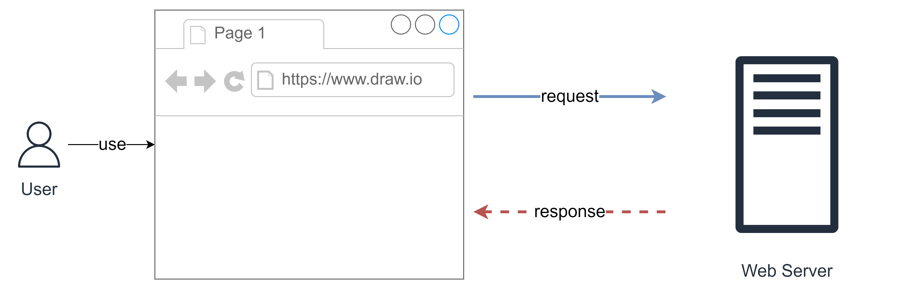

# Lecture 01: MVC Introduction

## Installation Instructions

For this course, we will use Visual Studio Code.

- https://code.visualstudio.com/

Then, we will use XAMPP. You can download it here:

- https://sourceforge.net/projects/xampp/files/XAMPP%20Windows/7.4.33/xampp-windows-x64-7.4.33-0-VC15-installer.exe/download

## Recap

Recap on basic knowledge of Web Application

## How MVC works

- `Model` - manages data and application logic
- `View` - presentation layer
- `Controller` - converts the input into commands ans send them to the View or Model

